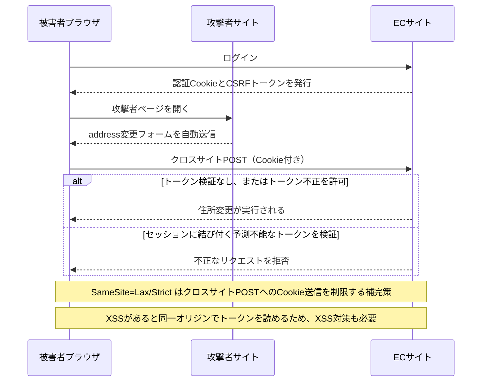

# CSRFトークンとSameSite

```mermaid
sequenceDiagram
    participant Victim as 被害者ブラウザ
    participant Attacker as 攻撃者サイト
    participant App as ECサイト

    Victim->>App: ログイン
    App-->>Victim: 認証CookieとCSRFトークンを発行
    Victim->>Attacker: 攻撃者ページを開く
    Attacker-->>Victim: address変更フォームを自動送信
    Victim->>App: クロスサイトPOST（Cookie付き）
    alt トークン検証なし、またはトークン不正を許可
        App-->>Victim: 住所変更が実行される
    else セッションに結び付く予測不能なトークンを検証
        App-->>Victim: 不正なリクエストを拒否
    end

    Note over Victim,App: SameSite=Lax/Strict はクロスサイトPOSTへのCookie送信を制限する補完策
    Note over Victim,App: XSSがあると同一オリジンでトークンを読めるため、XSS対策も必要
```
