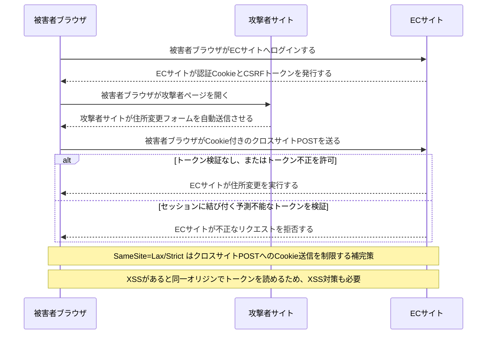

# CSRFトークンとSameSite

```mermaid
sequenceDiagram
    participant Victim as 被害者ブラウザ
    participant Attacker as 攻撃者サイト
    participant App as ECサイト

    Victim->>App: 被害者ブラウザがECサイトへログインする
    App-->>Victim: ECサイトが認証CookieとCSRFトークンを発行する
    Victim->>Attacker: 被害者ブラウザが攻撃者ページを開く
    Attacker-->>Victim: 攻撃者サイトが住所変更フォームを自動送信させる
    Victim->>App: 被害者ブラウザがCookie付きのクロスサイトPOSTを送る
    alt トークン検証なし、またはトークン不正を許可
        App-->>Victim: ECサイトが住所変更を実行する
    else セッションに結び付く予測不能なトークンを検証
        App-->>Victim: ECサイトが不正なリクエストを拒否する
    end

    Note over Victim,App: SameSite=Lax/Strict はクロスサイトPOSTへのCookie送信を制限する補完策
    Note over Victim,App: XSSがあると同一オリジンでトークンを読めるため、XSS対策も必要
```
