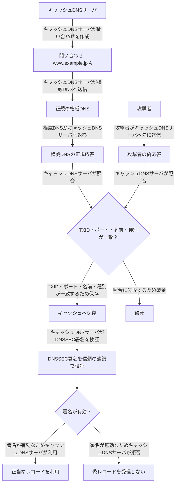

# DNSキャッシュポイズニングとDNSSEC

```mermaid
flowchart TB
    RESOLVER["キャッシュDNSサーバ"]
    AUTH["正規の権威DNS"]
    ATTACKER["攻撃者"]
    QUERY["問い合わせ: www.example.jp A"]
    RESPONSE["権威DNSの正規応答"]
    FAKE["攻撃者の偽応答"]
    MATCH{"TXID・ポート・名前・種別が一致？"}
    CACHE["キャッシュへ保存"]
    DROP["破棄"]

    RESOLVER -->|"キャッシュDNSサーバが問い合わせを作成"| QUERY
    QUERY -->|"キャッシュDNSサーバが権威DNSへ送信"| AUTH
    AUTH -->|"権威DNSがキャッシュDNSサーバへ返答"| RESPONSE
    RESPONSE -->|"キャッシュDNSサーバが照合"| MATCH
    ATTACKER -->|"攻撃者がキャッシュDNSサーバへ先に送信"| FAKE
    FAKE -->|"キャッシュDNSサーバが照合"| MATCH
    MATCH -->|"TXID・ポート・名前・種別が一致するため保存"| CACHE
    MATCH -->|"照合に失敗するため破棄"| DROP

    SIGN["DNSSEC署名を信頼の連鎖で検証"]
    VALID{"署名が有効？"}
    CACHE -->|"キャッシュDNSサーバがDNSSEC署名を検証"| SIGN
    SIGN --> VALID
    VALID -->|"署名が有効なためキャッシュDNSサーバが利用"| ACCEPT["正当なレコードを利用"]
    VALID -->|"署名が無効なためキャッシュDNSサーバが拒否"| REJECT["偽レコードを受理しない"]
```
