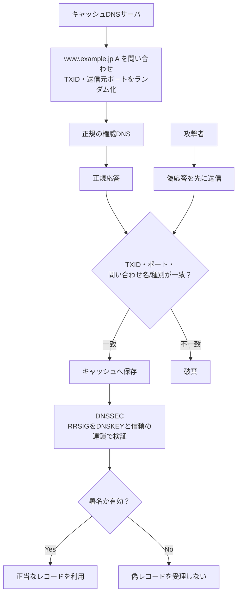

# DNSキャッシュポイズニングとDNSSEC

```mermaid
flowchart TB
    RESOLVER["キャッシュDNSサーバ"]
    AUTH["正規の権威DNS"]
    ATTACKER["攻撃者"]
    QUERY["www.example.jp A を問い合わせ<br/>TXID・送信元ポートをランダム化"]
    RESPONSE["正規応答"]
    FAKE["偽応答を先に送信"]
    MATCH{"TXID・ポート・<br/>問い合わせ名/種別が一致？"}
    CACHE["キャッシュへ保存"]
    DROP["破棄"]

    RESOLVER --> QUERY --> AUTH
    AUTH --> RESPONSE --> MATCH
    ATTACKER --> FAKE --> MATCH
    MATCH -->|"一致"| CACHE
    MATCH -->|"不一致"| DROP

    SIGN["DNSSEC<br/>RRSIGをDNSKEYと信頼の連鎖で検証"]
    VALID{"署名が有効？"}
    CACHE --> SIGN --> VALID
    VALID -->|"Yes"| ACCEPT["正当なレコードを利用"]
    VALID -->|"No"| REJECT["偽レコードを受理しない"]
```
