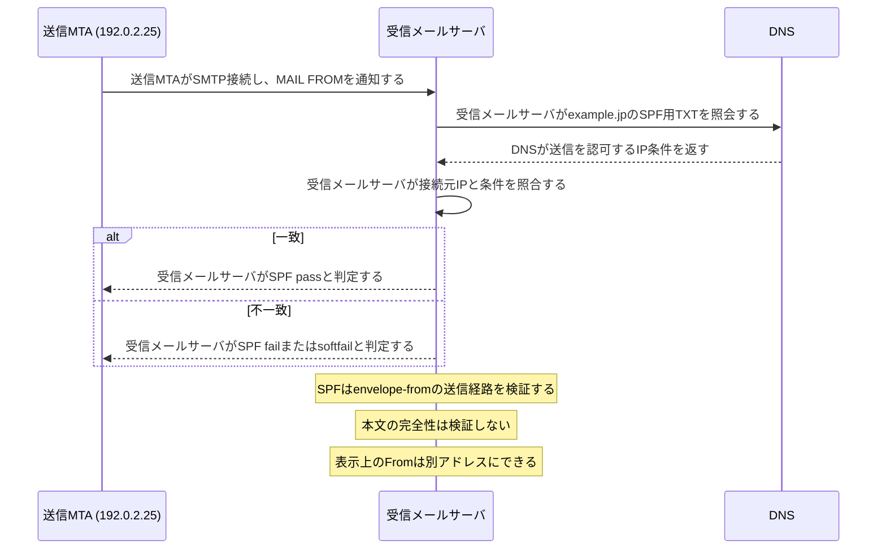

# SPF検証

```mermaid
sequenceDiagram
    participant Sender as 送信MTA (192.0.2.25)
    participant Receiver as 受信メールサーバ
    participant DNS as DNS

    Sender->>Receiver: 送信MTAがSMTP接続し、MAIL FROMを通知する
    Receiver->>DNS: 受信メールサーバがexample.jpのSPF用TXTを照会する
    DNS-->>Receiver: DNSが送信を認可するIP条件を返す
    Receiver->>Receiver: 受信メールサーバが接続元IPと条件を照合する
    alt 一致
        Receiver-->>Sender: 受信メールサーバがSPF passと判定する
    else 不一致
        Receiver-->>Sender: 受信メールサーバがSPF failまたはsoftfailと判定する
    end

    Note over Receiver: SPFはenvelope-fromの送信経路を検証する
    Note over Receiver: 本文の完全性は検証しない
    Note over Receiver: 表示上のFromは別アドレスにできる
```
