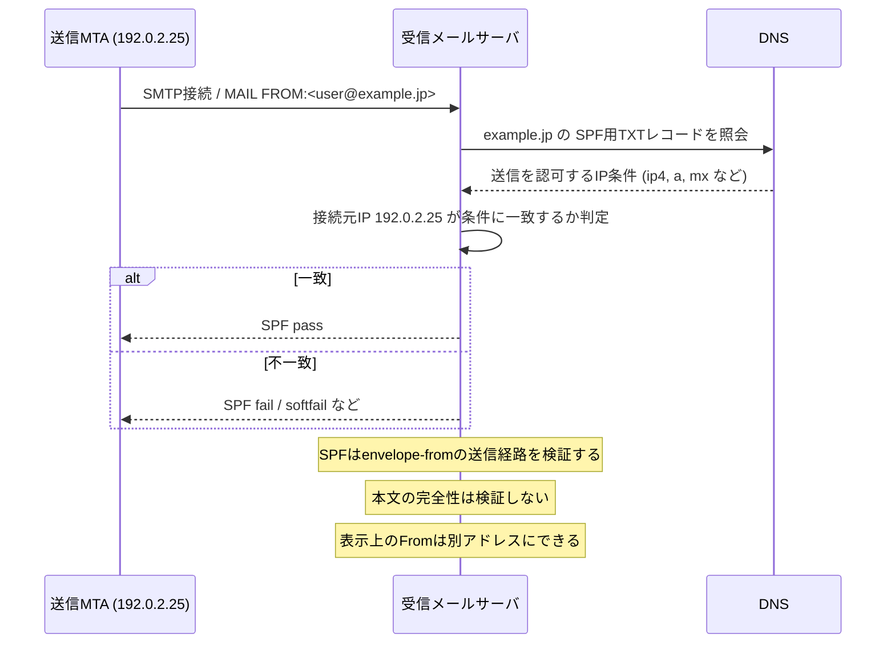

# SPF検証

```mermaid
sequenceDiagram
    participant Sender as 送信MTA (192.0.2.25)
    participant Receiver as 受信メールサーバ
    participant DNS as DNS

    Sender->>Receiver: SMTP接続 / MAIL FROM:<user@example.jp>
    Receiver->>DNS: example.jp の SPF用TXTレコードを照会
    DNS-->>Receiver: 送信を認可するIP条件 (ip4, a, mx など)
    Receiver->>Receiver: 接続元IP 192.0.2.25 が条件に一致するか判定
    alt 一致
        Receiver-->>Sender: SPF pass
    else 不一致
        Receiver-->>Sender: SPF fail / softfail など
    end

    Note over Receiver: SPFはenvelope-fromの送信経路を検証する
    Note over Receiver: 本文の完全性は検証しない
    Note over Receiver: 表示上のFromは別アドレスにできる
```
