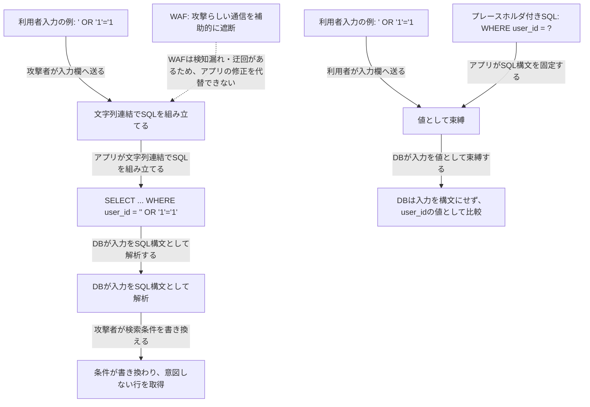

# SQLインジェクションとプレースホルダ

```mermaid
flowchart TB
    INPUT["利用者入力の例: ' OR '1'='1"]
    CONCAT["文字列連結でSQLを組み立てる"]
    SQL["SELECT ... WHERE user_id = '' OR '1'='1'"]
    PARSE["DBが入力をSQL構文として解析"]
    ATTACK["条件が書き換わり、意図しない行を取得"]

    INPUT -->|"攻撃者が入力欄へ送る"| CONCAT
    CONCAT -->|"アプリが文字列連結でSQLを組み立てる"| SQL
    SQL -->|"DBが入力をSQL構文として解析する"| PARSE
    PARSE -->|"攻撃者が検索条件を書き換える"| ATTACK

    INPUT2["利用者入力の例: ' OR '1'='1"]
    PREPARE["プレースホルダ付きSQL: WHERE user_id = ?"]
    BIND["値として束縛"]
    SAFE["DBは入力を構文にせず、user_idの値として比較"]

    INPUT2 -->|"利用者が入力欄へ送る"| BIND
    PREPARE -->|"アプリがSQL構文を固定する"| BIND
    BIND -->|"DBが入力を値として束縛する"| SAFE

    WAF["WAF: 攻撃らしい通信を補助的に遮断"] -. "WAFは検知漏れ・迂回があるため、アプリの修正を代替できない" .-> CONCAT
```
