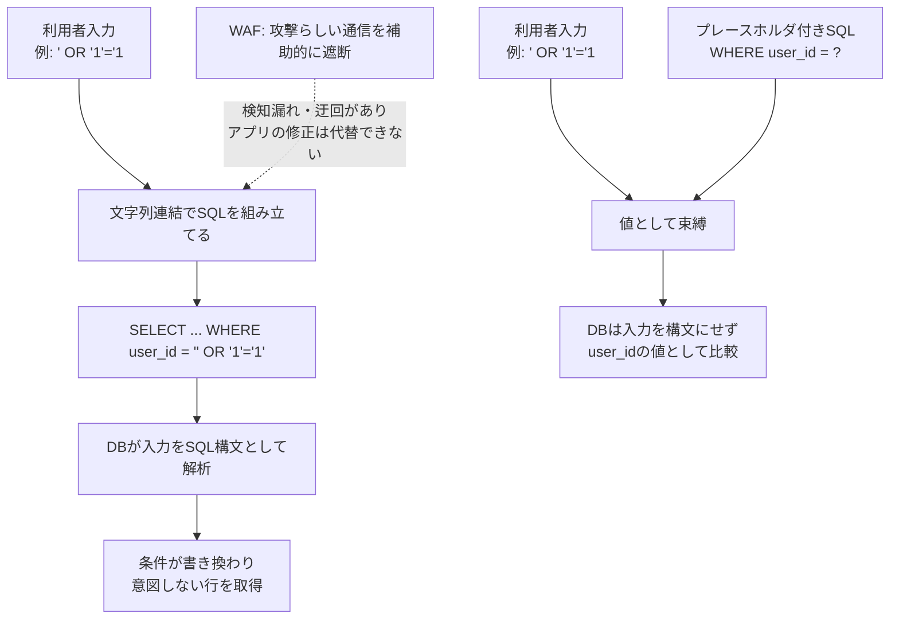

# SQLインジェクションとプレースホルダ

```mermaid
flowchart TB
    INPUT["利用者入力<br/>例: ' OR '1'='1"]
    CONCAT["文字列連結でSQLを組み立てる"]
    SQL["SELECT ... WHERE user_id = '' OR '1'='1'"]
    PARSE["DBが入力をSQL構文として解析"]
    ATTACK["条件が書き換わり<br/>意図しない行を取得"]

    INPUT --> CONCAT --> SQL --> PARSE --> ATTACK

    INPUT2["利用者入力<br/>例: ' OR '1'='1"]
    PREPARE["プレースホルダ付きSQL<br/>WHERE user_id = ?"]
    BIND["値として束縛"]
    SAFE["DBは入力を構文にせず<br/>user_idの値として比較"]

    INPUT2 --> BIND
    PREPARE --> BIND --> SAFE

    WAF["WAF: 攻撃らしい通信を補助的に遮断"] -. "検知漏れ・迂回があり<br/>アプリの修正は代替できない" .-> CONCAT
```
