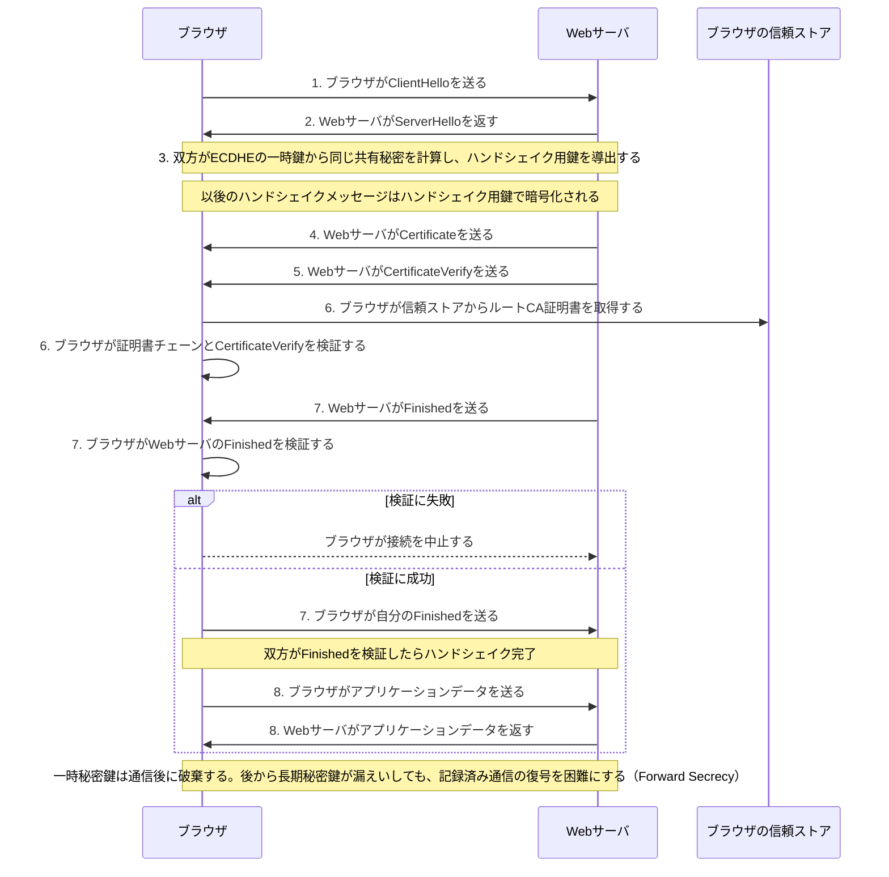

# TLS 1.3ハンドシェイク

この図は、Forward Secrecyを得るECDHE鍵共有を使う典型的なTLS 1.3の流れです。まず「何をするか」を8段階で追い、その下で各メッセージの中身を確認します。TLS 1.2以前とはメッセージの順序や暗号化される範囲が異なります。

1. **ClientHello**
   - ブラウザが対応するTLSバージョン・暗号方式・SNIと、ECDHE用の一時公開鍵を送る。
   - SNIは「`example.com` に接続したい」とWebサーバへ知らせる情報である。

2. **ServerHello**
   - Webサーバが採用するTLSバージョン・暗号方式と、ECDHE用の一時公開鍵を返す。

3. **共有秘密とハンドシェイク用鍵の導出**
   - 双方が自分の一時秘密鍵と相手の一時公開鍵から、同じ共有秘密をそれぞれ計算する。共有秘密そのものは送らない。
   - この共有秘密からハンドシェイク用の暗号鍵を導出する。以降の`Certificate`などは暗号化される。

4. **Certificate**
   - Webサーバがサーバ証明書と、必要な中間CA証明書をブラウザへ送る。
   - 証明書にはサーバ公開鍵、SAN、発行者CA、CAの署名などが入っている。

5. **CertificateVerify**
   - Webサーバが、証明書内の公開鍵に対応する秘密鍵でハンドシェイク内容へ署名する。
   - ブラウザは「このWebサーバは、送ってきた証明書に対応する秘密鍵を本当に持つ」と確認できる。

6. **証明書チェーンと署名の検証**
   - ブラウザは信頼ストア内のルートCAを起点に、CA署名・有効期限・SANの接続先名・必要に応じて失効状態を検証する。
   - `example.com` へ接続した場合、SANに `example.com` があり、チェーンも正しいことを確認して「この相手は本当に `example.com` 用の証明書を持つWebサーバ」と判断する。

7. **Finishedの相互検証**
   - Webサーバとブラウザは、それまでのハンドシェイク内容から計算した検証値を`Finished`として送り合う。
   - これにより、途中のハンドシェイク全体が改ざんされていないことを確認する。

8. **アプリケーションデータ通信**
   - 共有秘密から別途導出したアプリケーションデータ用鍵で、HTTPなどの上位プロトコルのデータを暗号化・認証して通信する。

補足: `EncryptedExtensions` はServerHelloの後、Certificateの前に送られるサーバ設定のメッセージである。この図では、8段階の主な流れに集中するため省略している。
