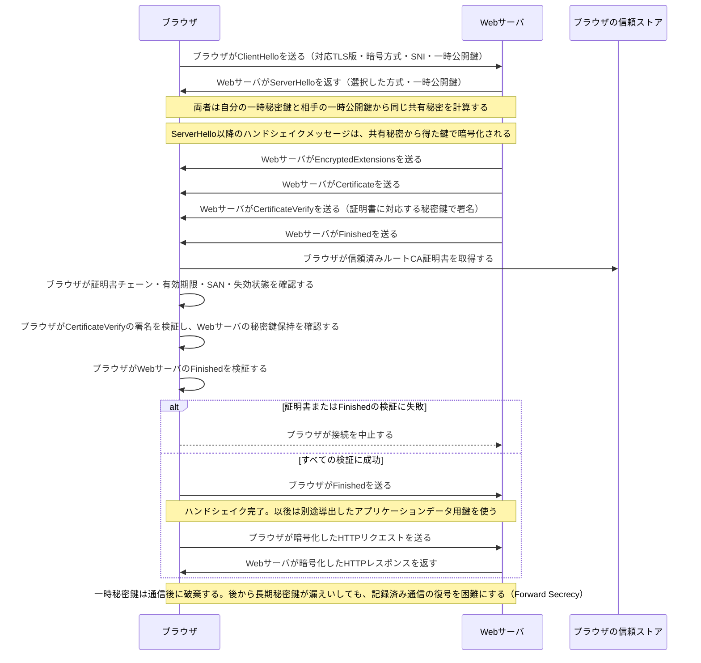

# TLS 1.3ハンドシェイク

この図は、Forward Secrecyを得るECDHE鍵共有を使う典型的なTLS 1.3の流れです。TLS 1.2以前とはメッセージの順序や暗号化される範囲が異なります。

- `SNI` は、ブラウザが接続したいホスト名をWebサーバへ知らせる拡張である。
- `CertificateVerify` は、Webサーバが証明書内の公開鍵に対応する秘密鍵を実際に持つことを示す。
- `Finished` は、それまでのハンドシェイク内容を基に検証し、途中で改ざんされていないことを確認する。
