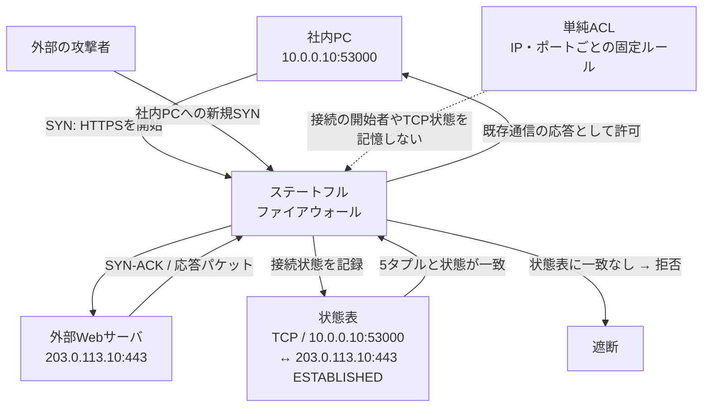

# ステートフルファイアウォール

```mermaid
flowchart TB
    PC["社内PC<br/>10.0.0.10:53000"]
    FW["ステートフル<br/>ファイアウォール"]
    WEB["外部Webサーバ<br/>203.0.113.10:443"]
    TABLE["状態表<br/>TCP / 10.0.0.10:53000<br/>↔ 203.0.113.10:443<br/>ESTABLISHED"]

    PC -->|"SYN: HTTPSを開始"| FW --> WEB
    FW -->|"接続状態を記録"| TABLE
    WEB -->|"SYN-ACK / 応答パケット"| FW
    TABLE -->|"5タプルと状態が一致"| FW
    FW -->|"既存通信の応答として許可"| PC

    OUTSIDE["外部の攻撃者"] -->|"社内PCへの新規SYN"| FW
    FW -->|"状態表に一致なし → 拒否"| BLOCK["遮断"]

    ACL["単純ACL<br/>IP・ポートごとの固定ルール"]
    ACL -. "接続の開始者やTCP状態を記憶しない" .-> FW
```
