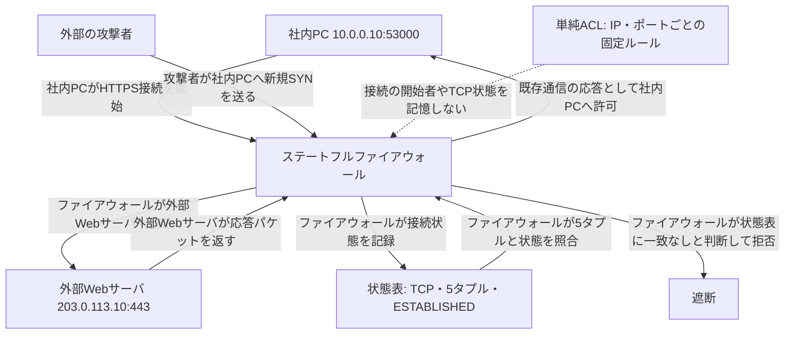

# ステートフルファイアウォール

```mermaid
flowchart TB
    PC["社内PC 10.0.0.10:53000"]
    FW["ステートフルファイアウォール"]
    WEB["外部Webサーバ 203.0.113.10:443"]
    TABLE["状態表: TCP・5タプル・ESTABLISHED"]

    PC -->|"社内PCがHTTPS接続を開始"| FW -->|"ファイアウォールが外部Webサーバへ転送"| WEB
    FW -->|"ファイアウォールが接続状態を記録"| TABLE
    WEB -->|"外部Webサーバが応答パケットを返す"| FW
    TABLE -->|"ファイアウォールが5タプルと状態を照合"| FW
    FW -->|"既存通信の応答として社内PCへ許可"| PC

    OUTSIDE["外部の攻撃者"] -->|"攻撃者が社内PCへ新規SYNを送る"| FW
    FW -->|"ファイアウォールが状態表に一致なしと判断して拒否"| BLOCK["遮断"]

    ACL["単純ACL: IP・ポートごとの固定ルール"]
    ACL -. "接続の開始者やTCP状態を記憶しない" .-> FW
```
