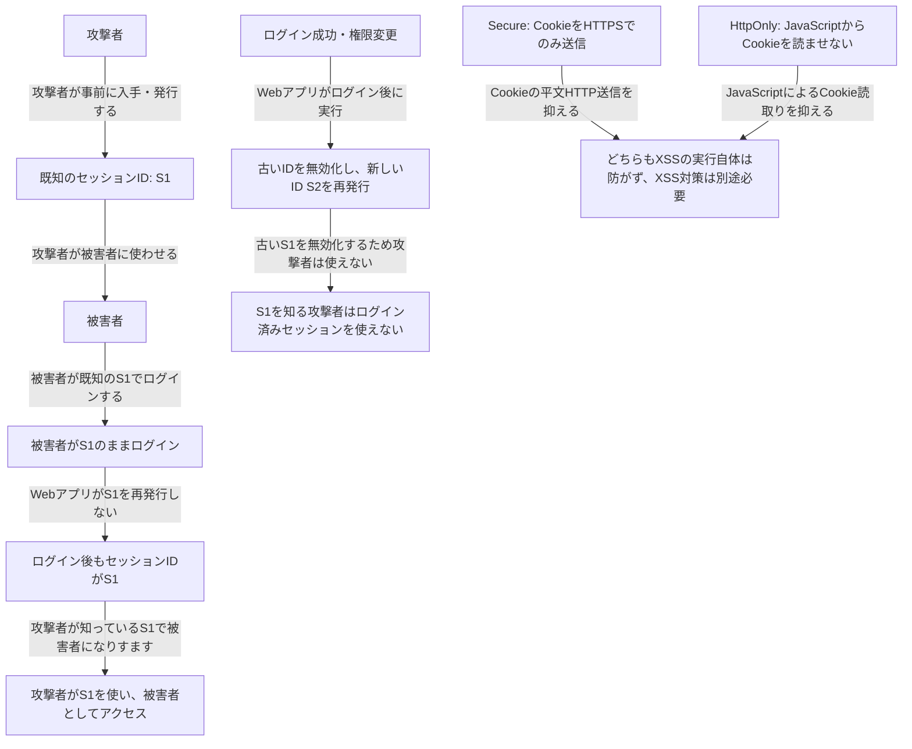

# セッション固定とCookie属性

```mermaid
flowchart TB
    ATTACKER["攻撃者"]
    KNOWN["既知のセッションID: S1"]
    VICTIM["被害者"]
    LOGIN["被害者がS1のままログイン"]
    NOREGEN["ログイン後もセッションIDがS1"]
    HIJACK["攻撃者がS1を使い、被害者としてアクセス"]

    ATTACKER -->|"攻撃者が事前に入手・発行する"| KNOWN
    KNOWN -->|"攻撃者が被害者に使わせる"| VICTIM
    VICTIM -->|"被害者が既知のS1でログインする"| LOGIN
    LOGIN -->|"WebアプリがS1を再発行しない"| NOREGEN
    NOREGEN -->|"攻撃者が知っているS1で被害者になりすます"| HIJACK

    LOGIN2["ログイン成功・権限変更"]
    REGEN["古いIDを無効化し、新しいID S2を再発行"]
    SAFE["S1を知る攻撃者はログイン済みセッションを使えない"]
    LOGIN2 -->|"Webアプリがログイン後に実行"| REGEN
    REGEN -->|"古いS1を無効化するため攻撃者は使えない"| SAFE

    SECURE["Secure: CookieをHTTPSでのみ送信"]
    HTTPONLY["HttpOnly: JavaScriptからCookieを読ませない"]
    LIMIT["どちらもXSSの実行自体は防がず、XSS対策は別途必要"]
    SECURE -->|"Cookieの平文HTTP送信を抑える"| LIMIT
    HTTPONLY -->|"JavaScriptによるCookie読取りを抑える"| LIMIT
```
