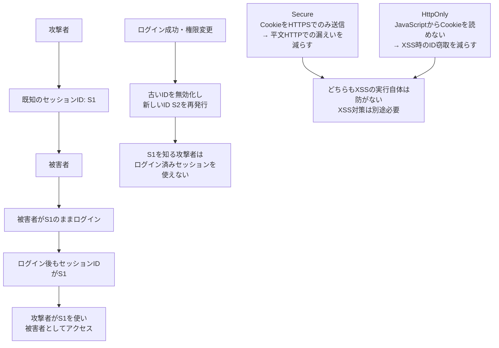

# セッション固定とCookie属性

```mermaid
flowchart TB
    ATTACKER["攻撃者"]
    KNOWN["既知のセッションID: S1"]
    VICTIM["被害者"]
    LOGIN["被害者がS1のままログイン"]
    NOREGEN["ログイン後もセッションIDがS1"]
    HIJACK["攻撃者がS1を使い<br/>被害者としてアクセス"]

    ATTACKER --> KNOWN --> VICTIM --> LOGIN --> NOREGEN --> HIJACK

    LOGIN2["ログイン成功・権限変更"]
    REGEN["古いIDを無効化し<br/>新しいID S2を再発行"]
    SAFE["S1を知る攻撃者は<br/>ログイン済みセッションを使えない"]
    LOGIN2 --> REGEN --> SAFE

    SECURE["Secure<br/>CookieをHTTPSでのみ送信<br/>→ 平文HTTPでの漏えいを減らす"]
    HTTPONLY["HttpOnly<br/>JavaScriptからCookieを読めない<br/>→ XSS時のID窃取を減らす"]
    LIMIT["どちらもXSSの実行自体は防がない<br/>XSS対策は別途必要"]
    SECURE --> LIMIT
    HTTPONLY --> LIMIT
```
