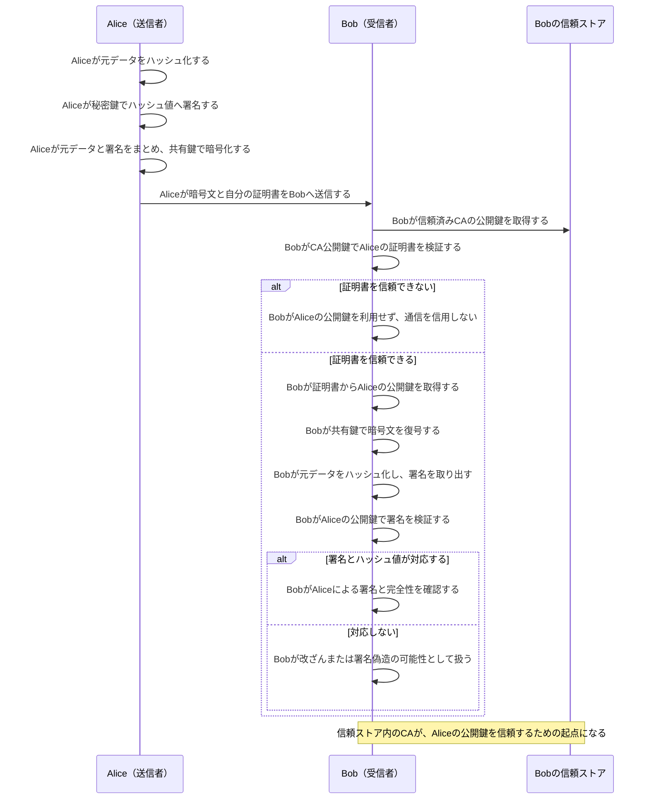

# デジタル署名とデジタル証明書

```mermaid
sequenceDiagram
    participant Alice as Alice（送信者）
    participant Bob as Bob（受信者）
    participant Store as Bobの信頼ストア

    Alice->>Alice: Aliceが元データをハッシュ化する
    Alice->>Alice: Aliceが秘密鍵でハッシュ値へ署名する
    Alice->>Alice: Aliceが元データと署名をまとめ、共有鍵で暗号化する
    Alice->>Bob: Aliceが暗号文と自分の証明書をBobへ送信する

    Bob->>Store: Bobが信頼済みCAの公開鍵を取得する
    Bob->>Bob: BobがCA公開鍵でAliceの証明書を検証する
    alt 証明書を信頼できない
        Bob->>Bob: BobがAliceの公開鍵を利用せず、通信を信用しない
    else 証明書を信頼できる
        Bob->>Bob: Bobが証明書からAliceの公開鍵を取得する
        Bob->>Bob: Bobが共有鍵で暗号文を復号する
        Bob->>Bob: Bobが元データをハッシュ化し、署名を取り出す
        Bob->>Bob: BobがAliceの公開鍵で署名を検証する
        alt 署名とハッシュ値が対応する
            Bob->>Bob: BobがAliceによる署名と完全性を確認する
        else 対応しない
            Bob->>Bob: Bobが改ざんまたは署名偽造の可能性として扱う
        end
    end

    Note over Store,Bob: 信頼ストア内のCAが、Aliceの公開鍵を信頼するための起点になる
```
