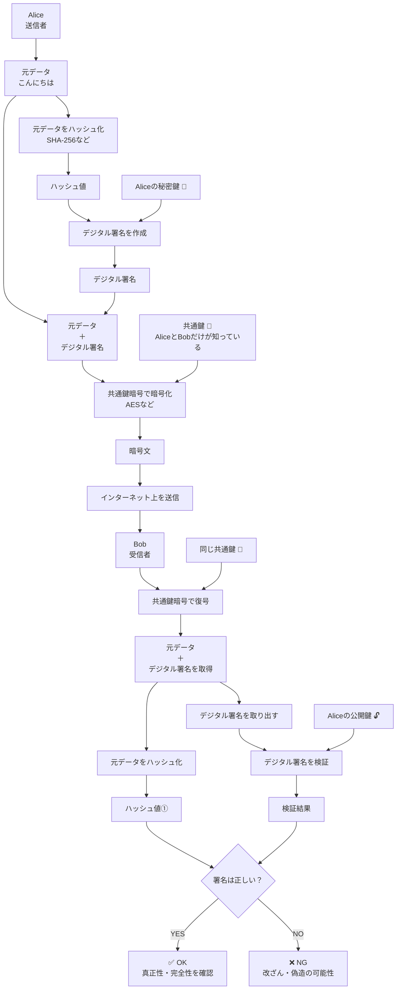

```mermaid
flowchart TB

    A["Alice<br/>送信者"]

    B["元データ<br/>こんにちは"]

    C["元データをハッシュ化<br/>SHA-256など"]

    D["ハッシュ値"]

    E["Aliceの秘密鍵 🔑"]

    F["デジタル署名を作成"]

    G["デジタル署名"]

    H["元データ<br/>＋<br/>デジタル署名"]

    I["共通鍵 🔑<br/>AliceとBobだけが知っている"]

    J["共通鍵暗号で暗号化<br/>AESなど"]

    K["暗号文"]

    L["インターネット上を送信"]

    M["Bob<br/>受信者"]

    N["同じ共通鍵 🔑"]

    O["共通鍵暗号で復号"]

    P["元データ<br/>＋<br/>デジタル署名を取得"]

    Q["元データをハッシュ化"]

    R["ハッシュ値①"]

    S["デジタル署名を取り出す"]

    T["Aliceの公開鍵 🔓"]

    U["デジタル署名を検証"]

    V["検証結果"]

    W{"署名は正しい？"}

    X["✅ OK<br/>真正性・完全性を確認"]

    Y["❌ NG<br/>改ざん・偽造の可能性"]

    A --> B

    B --> C
    C --> D

    D --> F
    E --> F
    F --> G

    B --> H
    G --> H

    H --> J
    I --> J

    J --> K
    K --> L
    L --> M

    M --> O
    N --> O

    O --> P

    P --> Q
    Q --> R

    P --> S
    S --> U

    T --> U
    U --> V

    R --> W
    V --> W

    W -->|YES| X
    W -->|NO| Y
```