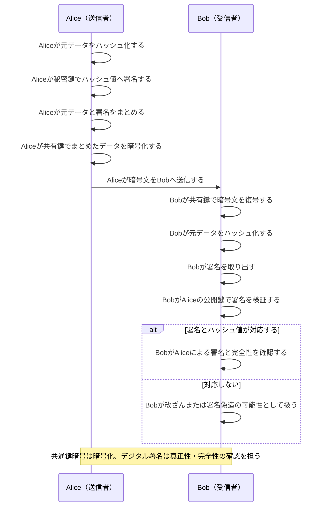

# デジタル署名

```mermaid
sequenceDiagram
    participant Alice as Alice（送信者）
    participant Bob as Bob（受信者）

    Alice->>Alice: Aliceが元データをハッシュ化する
    Alice->>Alice: Aliceが秘密鍵でハッシュ値へ署名する
    Alice->>Alice: Aliceが元データと署名をまとめる
    Alice->>Alice: Aliceが共有鍵でまとめたデータを暗号化する
    Alice->>Bob: Aliceが暗号文をBobへ送信する

    Bob->>Bob: Bobが共有鍵で暗号文を復号する
    Bob->>Bob: Bobが元データをハッシュ化する
    Bob->>Bob: Bobが署名を取り出す
    Bob->>Bob: BobがAliceの公開鍵で署名を検証する
    alt 署名とハッシュ値が対応する
        Bob->>Bob: BobがAliceによる署名と完全性を確認する
    else 対応しない
        Bob->>Bob: Bobが改ざんまたは署名偽造の可能性として扱う
    end

    Note over Alice,Bob: 共通鍵暗号は暗号化、デジタル署名は真正性・完全性の確認を担う
```
