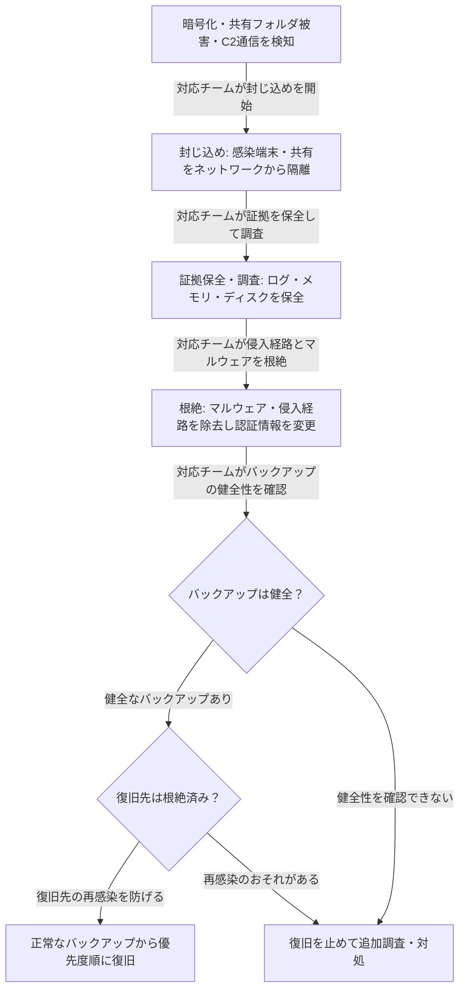

# ランサムウェア初動から復旧

```mermaid
flowchart TB
    DETECT["暗号化・共有フォルダ被害・C2通信を検知"]
    CONTAIN["封じ込め: 感染端末・共有をネットワークから隔離"]
    PRESERVE["証拠保全・調査: ログ・メモリ・ディスクを保全"]
    ERADICATE["根絶: マルウェア・侵入経路を除去し認証情報を変更"]
    CHECK1{"バックアップは健全？"}
    CHECK2{"復旧先は根絶済み？"}
    RESTORE["正常なバックアップから優先度順に復旧"]
    STOP["復旧を止めて追加調査・対処"]

    DETECT -->|"対応チームが封じ込めを開始"| CONTAIN
    CONTAIN -->|"対応チームが証拠を保全して調査"| PRESERVE
    PRESERVE -->|"対応チームが侵入経路とマルウェアを根絶"| ERADICATE
    ERADICATE -->|"対応チームがバックアップの健全性を確認"| CHECK1
    CHECK1 -->|"健全なバックアップあり"| CHECK2
    CHECK1 -->|"健全性を確認できない"| STOP
    CHECK2 -->|"復旧先の再感染を防げる"| RESTORE
    CHECK2 -->|"再感染のおそれがある"| STOP
```
