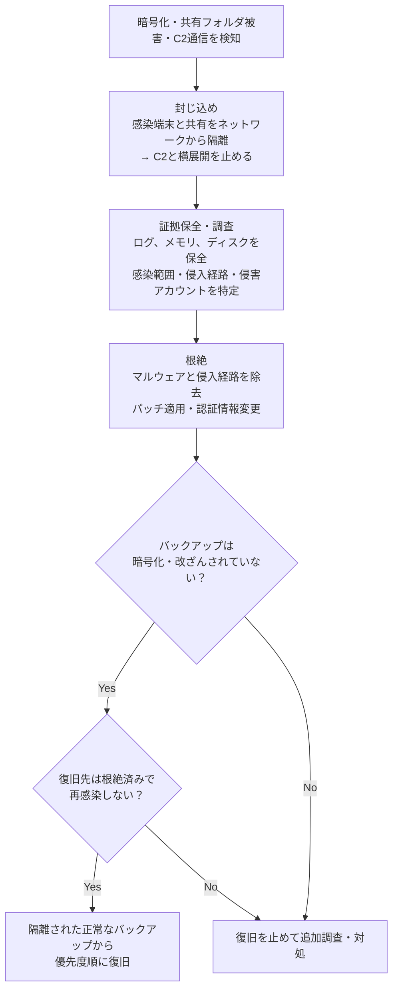

# ランサムウェア初動から復旧

```mermaid
flowchart TB
    DETECT["暗号化・共有フォルダ被害・C2通信を検知"]
    CONTAIN["封じ込め<br/>感染端末と共有をネットワークから隔離<br/>→ C2と横展開を止める"]
    PRESERVE["証拠保全・調査<br/>ログ、メモリ、ディスクを保全<br/>感染範囲・侵入経路・侵害アカウントを特定"]
    ERADICATE["根絶<br/>マルウェアと侵入経路を除去<br/>パッチ適用・認証情報変更"]
    CHECK1{"バックアップは<br/>暗号化・改ざんされていない？"}
    CHECK2{"復旧先は根絶済みで<br/>再感染しない？"}
    RESTORE["隔離された正常なバックアップから<br/>優先度順に復旧"]
    STOP["復旧を止めて追加調査・対処"]

    DETECT --> CONTAIN --> PRESERVE --> ERADICATE --> CHECK1
    CHECK1 -->|"Yes"| CHECK2
    CHECK1 -->|"No"| STOP
    CHECK2 -->|"Yes"| RESTORE
    CHECK2 -->|"No"| STOP
```
