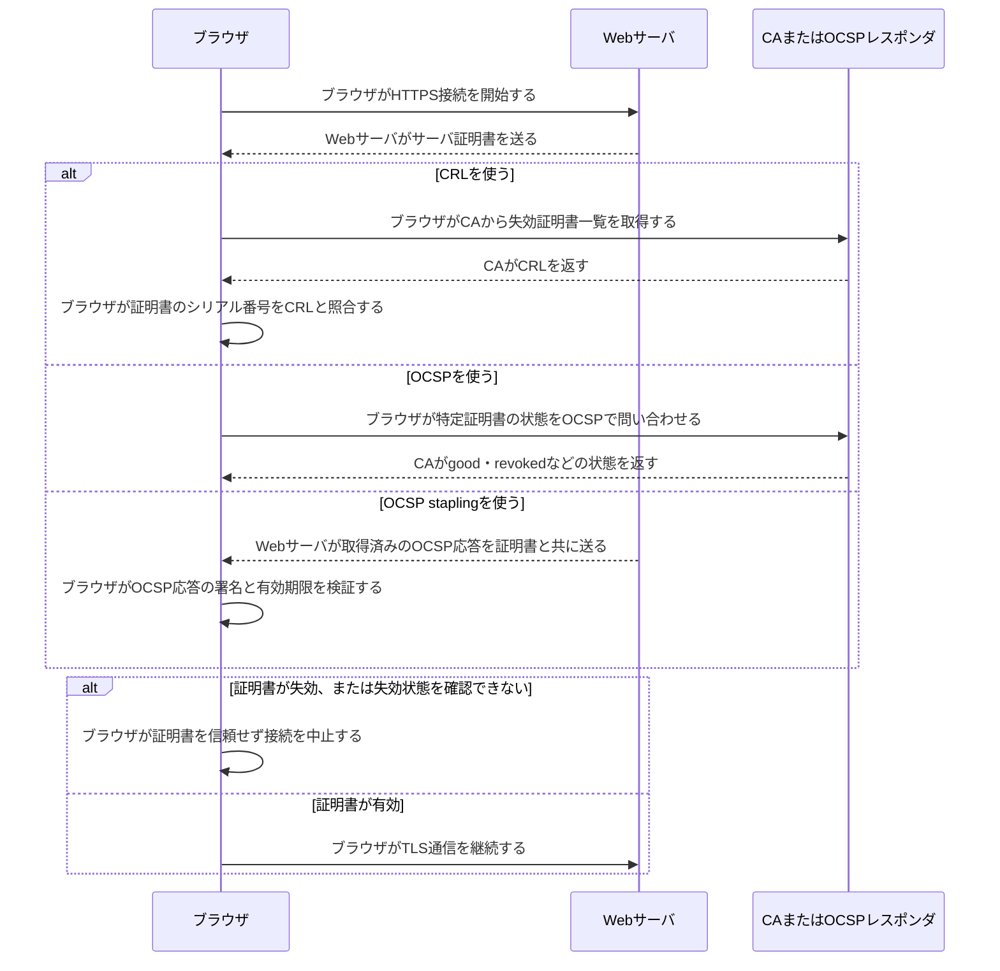

# CRLとOCSPの失効確認

```mermaid
sequenceDiagram
    participant Browser as ブラウザ
    participant Server as Webサーバ
    participant CA as CAまたはOCSPレスポンダ

    Browser->>Server: ブラウザがHTTPS接続を開始する
    Server-->>Browser: Webサーバがサーバ証明書を送る

    alt CRLを使う
        Browser->>CA: ブラウザがCAから失効証明書一覧を取得する
        CA-->>Browser: CAがCRLを返す
        Browser->>Browser: ブラウザが証明書のシリアル番号をCRLと照合する
    else OCSPを使う
        Browser->>CA: ブラウザが特定証明書の状態をOCSPで問い合わせる
        CA-->>Browser: CAがgood・revokedなどの状態を返す
    else OCSP staplingを使う
        Server-->>Browser: Webサーバが取得済みのOCSP応答を証明書と共に送る
        Browser->>Browser: ブラウザがOCSP応答の署名と有効期限を検証する
    end

    alt 証明書が失効、または失効状態を確認できない
        Browser->>Browser: ブラウザが証明書を信頼せず接続を中止する
    else 証明書が有効
        Browser->>Server: ブラウザがTLS通信を継続する
    end
```

- `CRL`はCAが公開する失効証明書の一覧を取得し、証明書のシリアル番号が含まれるかを調べる方式である。
- `OCSP`は、特定の証明書について有効・失効などの状態を問い合わせる方式である。
- `OCSP stapling`ではWebサーバが取得済みのOCSP応答を添えるため、ブラウザは通常CAへ直接照会しなくてよい。
