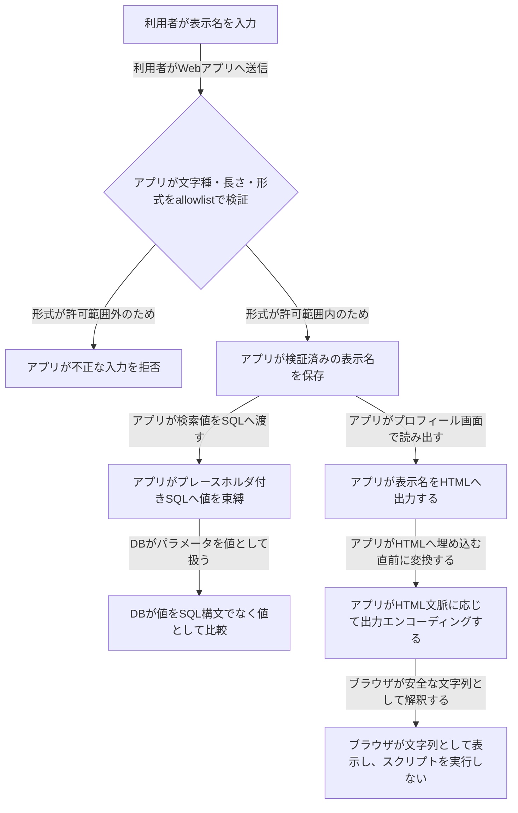

# 入力検証と出力エンコーディング

```mermaid
flowchart TB
    INPUT["利用者が表示名を入力"]
    VALIDATE{"アプリが文字種・長さ・形式をallowlistで検証"}
    REJECT["アプリが不正な入力を拒否"]
    STORE["アプリが検証済みの表示名を保存"]
    SQL["アプリがプレースホルダ付きSQLへ値を束縛"]
    DB["DBが値をSQL構文でなく値として比較"]
    OUTPUT["アプリが表示名をHTMLへ出力する"]
    ENCODE["アプリがHTML文脈に応じて出力エンコーディングする"]
    BROWSER["ブラウザが文字列として表示し、スクリプトを実行しない"]

    INPUT -->|"利用者がWebアプリへ送信"| VALIDATE
    VALIDATE -->|"形式が許可範囲外のため"| REJECT
    VALIDATE -->|"形式が許可範囲内のため"| STORE
    STORE -->|"アプリが検索値をSQLへ渡す"| SQL
    SQL -->|"DBがパラメータを値として扱う"| DB
    STORE -->|"アプリがプロフィール画面で読み出す"| OUTPUT
    OUTPUT -->|"アプリがHTMLへ埋め込む直前に変換する"| ENCODE
    ENCODE -->|"ブラウザが安全な文字列として解釈する"| BROWSER
```

- 入力検証は、想定する文字種・長さ・形式だけを受け付ける処理である。
- プレースホルダによるパラメータ化クエリは、SQL構文と値を分離してSQLインジェクションを防ぐ。入力検証とは別の対策である。
- 出力エンコーディングは、HTMLなどの出力先の文脈に合わせて表示直前に行い、XSSを防ぐ。
