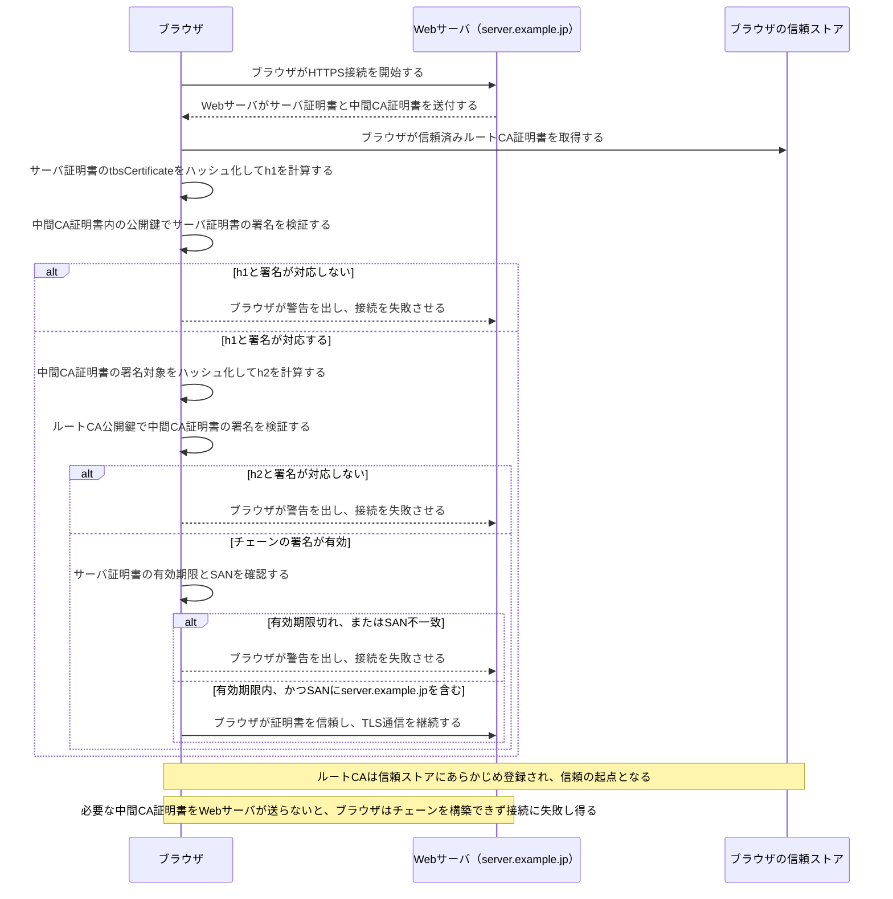

# 証明書チェーン検証

これは、HTTPS通信の開始時に行うTLSハンドシェイクのうち、ブラウザがWebサーバ証明書を検証してサーバ認証を行う部分を取り出した図です。TLS全体の流れは [TLS 1.3ハンドシェイク](TLS1.3ハンドシェイク.md) を参照してください。

RSA署名なら「発行者の公開鍵で署名からハッシュ値相当を得て照合する」と簡略化して考えられます。ECDSAなどでは、公開鍵・署名値・計算したハッシュ値を使い、署名が対応するかを真偽で判定します。いずれの場合も、比較するのは**サーバ証明書と中間CA証明書そのものではなく**、サーバ証明書から計算したハッシュ値と、その署名の検証結果です。
