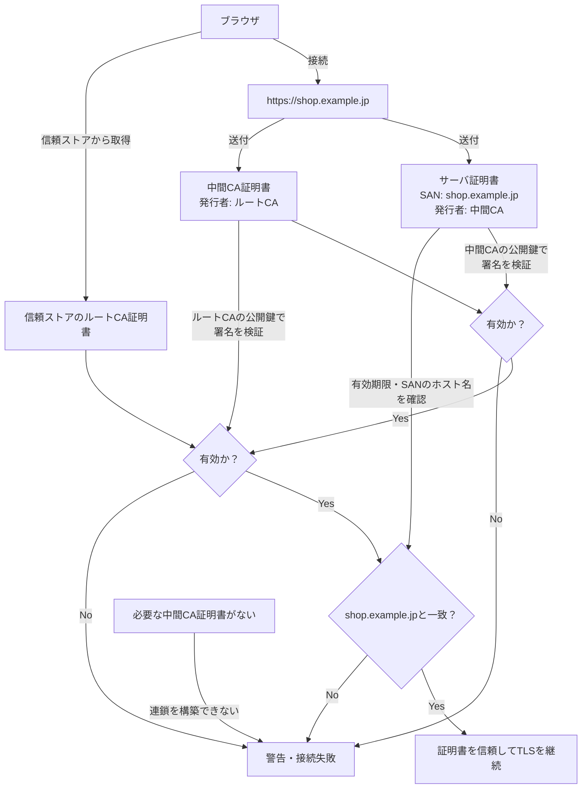

# 証明書チェーン検証

```mermaid
flowchart TB
    BROWSER["ブラウザ"]
    SERVER["https://shop.example.jp"]
    LEAF["サーバ証明書<br/>SAN: shop.example.jp<br/>発行者: 中間CA"]
    INTERMEDIATE["中間CA証明書<br/>発行者: ルートCA"]
    ROOT["信頼ストアのルートCA証明書"]

    BROWSER -->|"接続"| SERVER
    SERVER -->|"送付"| LEAF
    SERVER -->|"送付"| INTERMEDIATE
    BROWSER -->|"信頼ストアから取得"| ROOT

    LEAF -->|"中間CAの公開鍵で<br/>署名を検証"| CHECK1{"有効か？"}
    INTERMEDIATE --> CHECK1
    INTERMEDIATE -->|"ルートCAの公開鍵で<br/>署名を検証"| CHECK2{"有効か？"}
    ROOT --> CHECK2
    LEAF -->|"有効期限・SANのホスト名を確認"| CHECK3{"shop.example.jpと一致？"}

    CHECK1 -->|"Yes"| CHECK2
    CHECK2 -->|"Yes"| CHECK3
    CHECK3 -->|"Yes"| TRUST["証明書を信頼してTLSを継続"]
    CHECK1 -->|"No"| FAIL["警告・接続失敗"]
    CHECK2 -->|"No"| FAIL
    CHECK3 -->|"No"| FAIL

    MISSING["必要な中間CA証明書がない"] -->|"連鎖を構築できない"| FAIL
```
