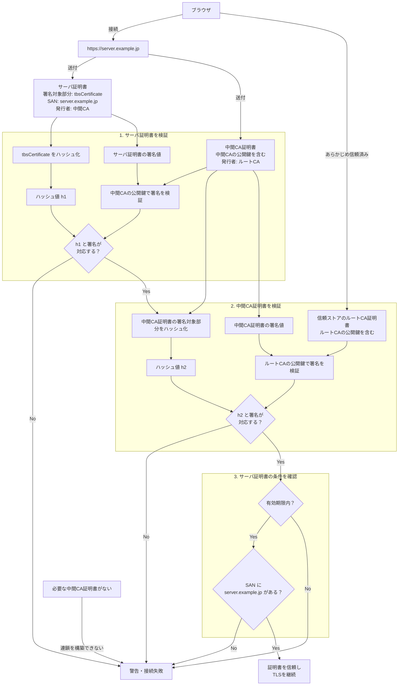

# 証明書チェーン検証

```mermaid
flowchart TB
    BROWSER["ブラウザ"]
    SERVER["https://server.example.jp"]
    LEAF["サーバ証明書<br/>署名対象部分: tbsCertificate<br/>SAN: server.example.jp<br/>発行者: 中間CA"]
    INTERMEDIATE["中間CA証明書<br/>中間CAの公開鍵を含む<br/>発行者: ルートCA"]
    ROOT["信頼ストアのルートCA証明書<br/>ルートCAの公開鍵を含む"]

    BROWSER -->|"接続"| SERVER
    SERVER -->|"送付"| LEAF
    SERVER -->|"送付"| INTERMEDIATE
    BROWSER -->|"あらかじめ信頼済み"| ROOT

    subgraph LEAF_VERIFY["1. サーバ証明書を検証"]
        LEAF_HASH["tbsCertificate をハッシュ化"] --> LEAF_H["ハッシュ値 h1"] --> LEAF_MATCH
        LEAF_SIG["サーバ証明書の署名値"] --> LEAF_SIGCHECK["中間CAの公開鍵で署名を検証"]
        INTERMEDIATE --> LEAF_SIGCHECK
        LEAF_SIGCHECK --> LEAF_MATCH{"h1 と署名が<br/>対応する？"}
    end

    LEAF --> LEAF_HASH
    LEAF --> LEAF_SIG
    LEAF_MATCH -->|"No"| FAIL["警告・接続失敗"]

    subgraph INTERMEDIATE_VERIFY["2. 中間CA証明書を検証"]
        INT_HASH["中間CA証明書の署名対象部分をハッシュ化"] --> INT_H["ハッシュ値 h2"] --> INT_MATCH
        INT_SIG["中間CA証明書の署名値"] --> INT_SIGCHECK["ルートCAの公開鍵で署名を検証"]
        ROOT --> INT_SIGCHECK
        INT_SIGCHECK --> INT_MATCH{"h2 と署名が<br/>対応する？"}
    end

    INTERMEDIATE --> INT_HASH
    INTERMEDIATE --> INT_SIG
    LEAF_MATCH -->|"Yes"| INT_HASH
    INT_MATCH -->|"No"| FAIL

    subgraph LEAF_CHECKS["3. サーバ証明書の条件を確認"]
        EXPIRE{"有効期限内？"}
        HOST{"SAN に<br/>server.example.jp がある？"}
        EXPIRE -->|"Yes"| HOST
    end

    INT_MATCH -->|"Yes"| EXPIRE
    EXPIRE -->|"No"| FAIL
    HOST -->|"No"| FAIL
    HOST -->|"Yes"| TRUST["証明書を信頼し<br/>TLSを継続"]

    MISSING["必要な中間CA証明書がない"] -->|"連鎖を構築できない"| FAIL
```

RSA署名なら「発行者の公開鍵で署名からハッシュ値相当を得て照合する」と簡略化して考えられます。ECDSAなどでは、公開鍵・署名値・計算したハッシュ値を使い、署名が対応するかを真偽で判定します。いずれの場合も、比較するのは**サーバ証明書と中間CA証明書そのものではなく**、サーバ証明書から計算したハッシュ値と、その署名の検証結果です。
